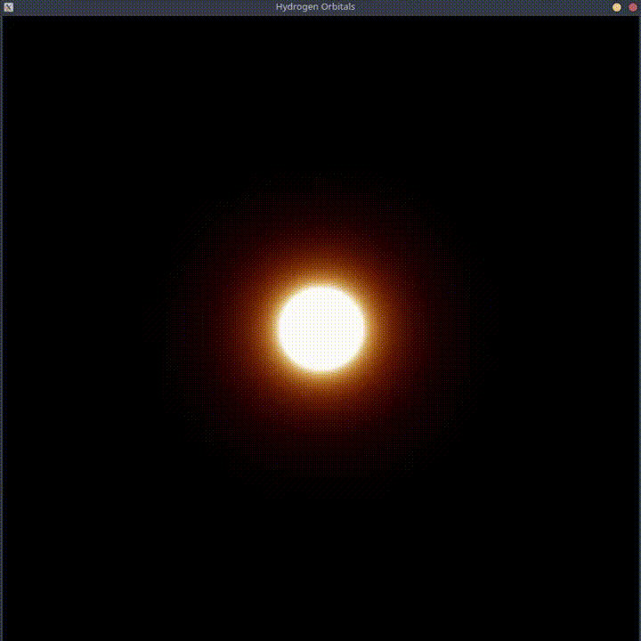

# Hydrogen Orbitals Visualizer

A quantum mechanics visualizer written in C. It computes and renders 2D cross-sections of hydrogen electron orbital probability densities in real-time using SDL2.

### Demo



### Probability Density

For each screen pixel, the code evaluates the probability density in the **x–z plane** (a 2D slice through the 3D orbital with y = 0):

$$
P(x, z) = \left|\Psi_{n,l,m}(r, \theta, \phi)\right|^2, \qquad r = \sqrt{x^2 + z^2}
$$

This is computed in `compute_orbital_probability` by combining the radial and angular factors and squaring the result.

## Core Mathematical Components

The total wave function is the product of two independently computed factors:

$$
\Psi_{n,l,m}(r, \theta, \phi) = R_{n,l}(r)\, Y_{l}^{m}(\theta, \phi)
$$

| Component | Function | Polynomial engine | Role |
|-----------|----------|-------------------|------|
| Radial $R_{n,l}(r)$ | `compute_radial_wave_function` | `compute_laguerre` | Distance from nucleus; radial nodes |
| Angular $Y_{l}^{m}(\theta, \phi)$ | `compute_spherical_harmonic` | `compute_legendre` | Lobe geometry and orientation |


---

## Project Structure

```text
hydrogen-orbitals/
├── src/
│   └── main.c
├── demo.gif
└── README.md
```
